# Configurando placa de som no Windows 3.11
Inserir o disquete **sb16.ima** no drive A e digitar o comando abaixo na linha de comando do MS-DOS.

```
a:\install
```

Pressionar a tecla 'Enter' para iniciar o processo de instalação.

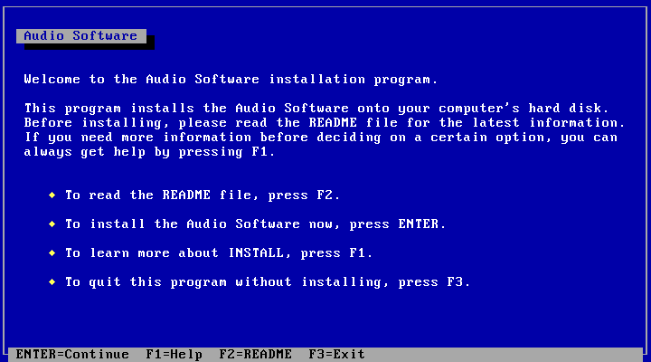

Pressionar a tecla 'Enter' para aceitar a sugestão de diretório para instalação dos arquivos referentes a placa de som.

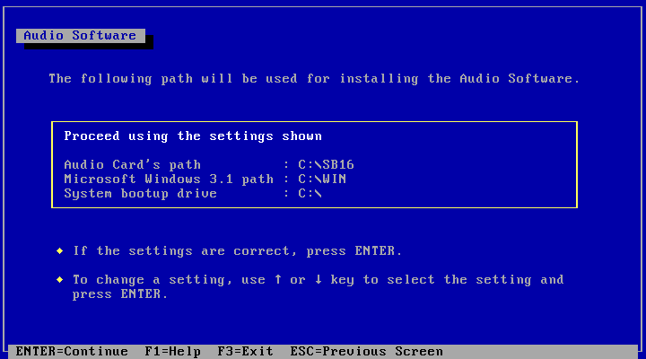

Pressionar a tecla 'Enter' para aceitar as configurações detectadas pelo programa de instalação.

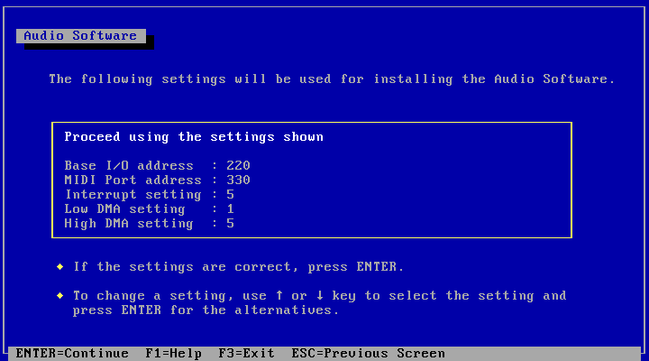

Pressionar a tecla 'Enter' para continuar com o processo de configuração.

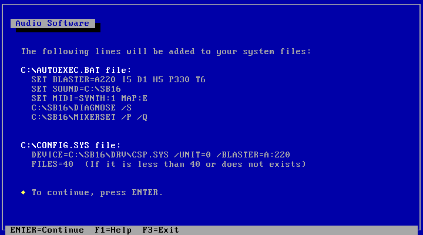

Selecione o item 'Proceed' e pressionar a tecla 'Enter'

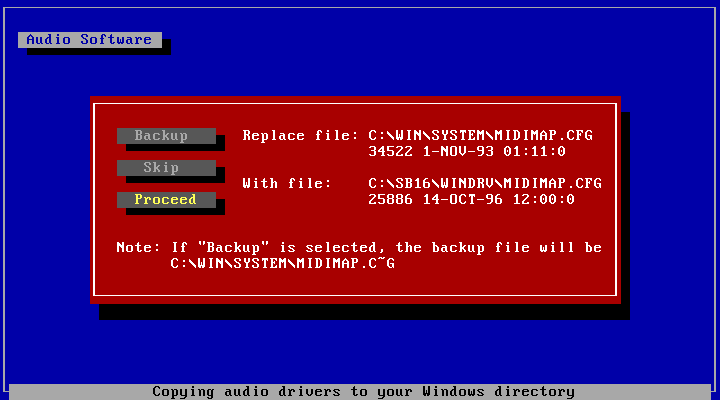

Pressione a tecla 'F10' para reiniciar o sistema operacional.

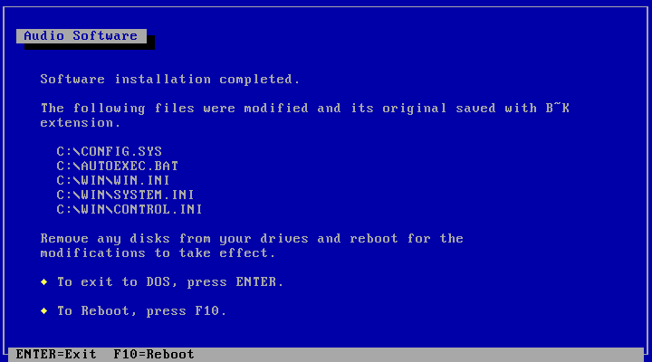

Quando o sistema operacional for reiniciado, será apresentado as seguintes informações sobre a configuração da placa de som.

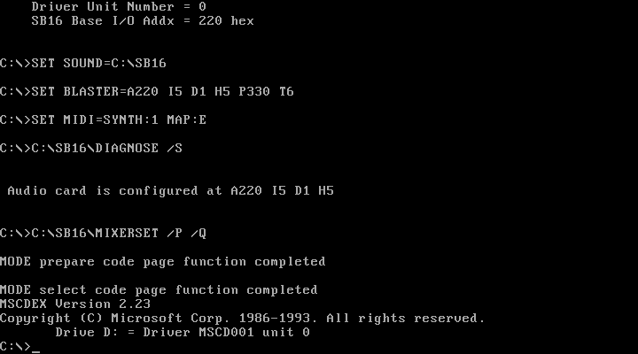

Ao carregar o Windows 3.11 será exibida uma tela informando que o grupo de programas chamado 'Audio Software' foi criado. Clicar no botão 'OK'.

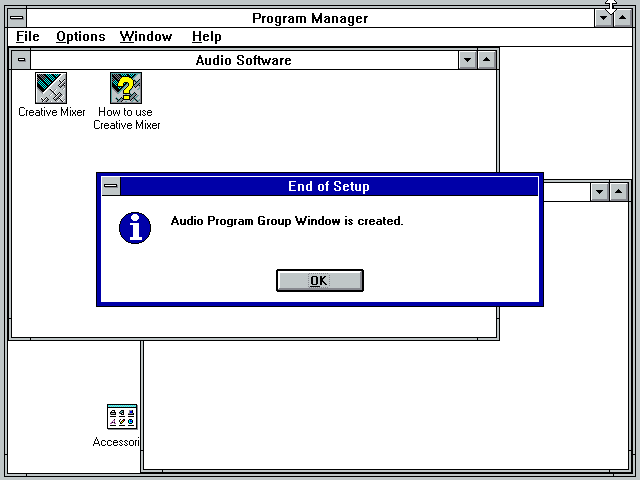

Fechar a janela referente ao grupo de programas 'Audio Software' e clicar duas vezes no ícone 'Control Panel'

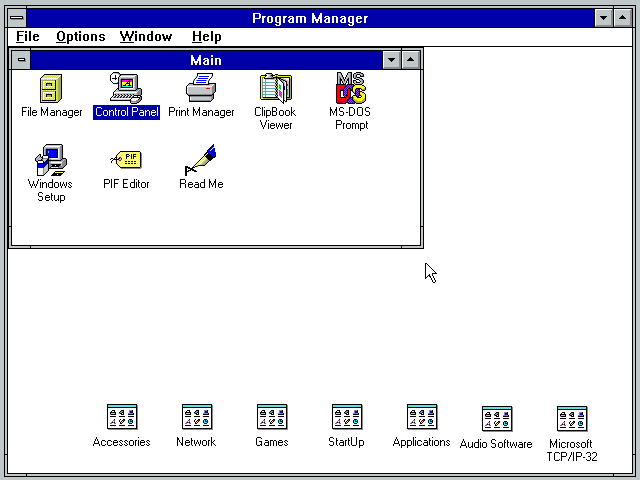

Clicar duas vezes no ícone 'Sound'

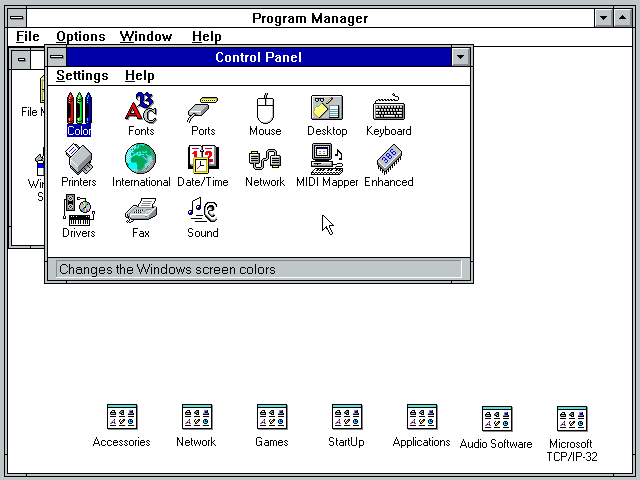

Selecionar o ítem 'chimes.wav', por exemplo, e clicar no botão 'Test' para testar a placa de som.

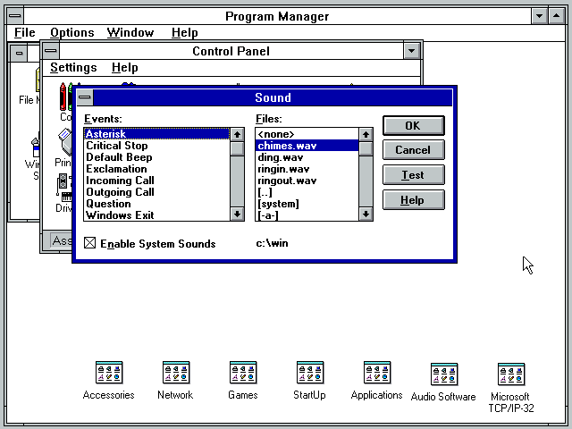

**Pronto!!!** A placa de som esta configurada no Windows 3.11 for Workgroups.

