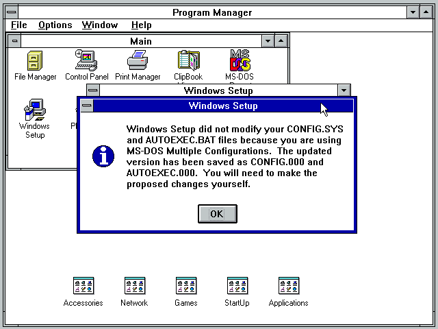

# Configurando placa de rede no Windows 3.11
Inserir o disquete **win311-pcnet-network.img** no drive A e dar duplo clique no ícone 'Windows Setup'.


Selecionar o menu Options > Change Network Settings...


Clicar no botão 'Networks...'


Selecionar a opção 'Install Microsoft Windows Network'


Clicar no botão 'Ok'


Clicar no botão 'Drivers'


Clicar no botão 'Add Adapter...'


Manter o item 'Unlisted or Updated Network Adapter' selecionado e clicar no botão 'Ok'


Clicar no botão 'Browse...'


Selecionar o drive A e o diretório 'wfw311' e clicar no botão 'Ok'


Clicar no botão OK


Clicar no botão 'Close'


Clicar no botão 'OK'


Se necessário, alterar o nome do usuário e o nome do grupo de trabalho e clicar no botão 'Ok'


Aguardar o término da configuração do adaptador de rede.


Clicar no botão 'OK'



Clicar no botão 'OK'


Clicar no botão 'Restart Computer'


Quando o Windows reiniciar, provavelmente será exibida a mensagem abaixo.


Para corrigir o problema acima, será necessário incluir a linha abaixo no arquivo CONFIG.SYS que esta na raíz do sistema operacional MS-DOS.

```
DEVICE=<path-windows>\IFSHLP.SYS
```

Salvar o arquivo CONFIG.SYS, reiniciar a máquina virtual, carregar o Windows 3.11, será exibida a tela abaixo. Informar uma senha e clicar no botão 'OK'.


Clicar no botão 'Yes' para con rmar que o arquivo de senhas deve ser criado.


Repetir a senha e clicar no botão 'OK'


**Pronto!!!** O adaptador de rede está configurado no Windows 3.11 for Workgroups.


