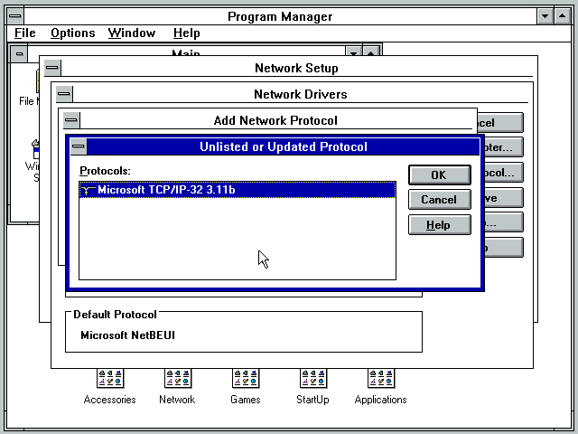
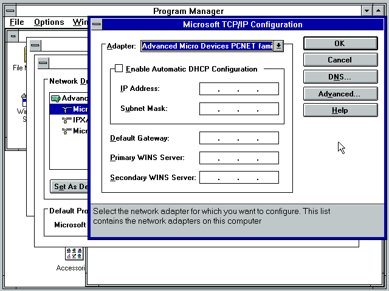

# Configurando Protocolo TCP/IP no Windows 3.11
Inserir o CD **win311-tcp.iso** no drive de CD-ROM e dar duplo clique no ícone 'Windows Setup'.

Selecionar o menu Options > Change Network Settings...

Clicar no botão 'Drivers...'

Clicar no botão 'Add Protocol...'

Manter o item 'Unlisted or Updated Protocol' selecionado e clicar no botão 'OK'

Selecionar o drive D e clicar no botão 'Ok'

Clicar no botão 'OK'

Selecionar o item 'Microsoft TCP/IP-32 3.11b'

Clicar no botão 'Set As Default Protocol'

Selecionar o item 'Microsoft TCP/IP-32 3.11b' e clicar no botão 'Setup...'

Marcar a opção 'Enable Automatic DHCP Configuration'

Clicar no botão 'Yes' para habilitar o DHCP.

Preencher o campo 'Default Gateway' com o gateway padrão da sua rede.

**Obs:** O modo de rede padrão utilizado pelo VirtualBox é o modo bridge. Portanto, a máquina virtual que você esta criando, terá um IP fornecido pelo roteador da sua rede.

Clicar no botão 'Close'

Clicar no botão 'OK'

Clicar no botão 'OK'

Clicar no botão 'OK'

Clicar no botão 'Restart Computer'

Ao reinciar o computador e carregar o Windows 3.11 novamente será exibido um novo grupo de aplicativos.

Para verificar se a configuração do protocolo TCP deu certo e ver qual endereço IP a máquina virtual recebeu, clicar no icone 'Ms-DOS Prompt'

Digitar o comando 'ipconfig' na linha de comando do Ms-DOS.

O resultado do comando 'ipconfig' será o IP atribuído a sua máquina virtual pelo servidor DHCP que está no seu roteador.

**Pronto!!!** O protocolo TCP esta con gurado no Windows 3.11 for Workgroups.

