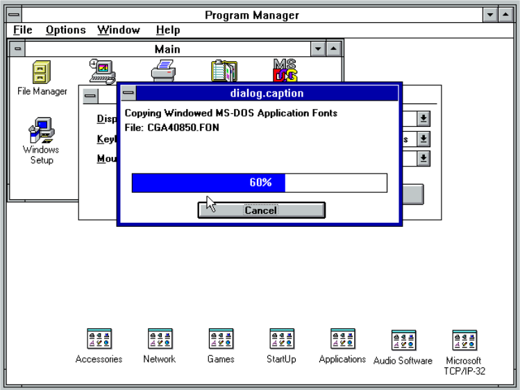

# Configurando placa de vídeo no Windows 3.11

Inserir o disquete **win311-et4000svga.ima** no drive A e dar duplo clique no ícone 'Windows Setup'.

Selecionar o menu Options > Change System Settings...

No campo 'Display' selecionar o ítem 'Other display (Requires disk from OEM)...

Clicar no botão 'OK'

Selecionar o item 'ET4000 1024x768 256 Small' e clicar no botão 'OK'.

**Obs:** Caso deseje outra resolução, basta selecionar o item correspondente a sua necessidade.

Clicar no botão 'OK'

Aguardar o processo de instalação nalizar.

Clicar no botão 'Restart Windows'

Quando o Windows 3.11 reinciar, você perceberá que o tamanho da tela aumentou significativamente.

**Pronto!!!** A placa de vídeo esta configurada no Windows 3.11 for Workgroups.

